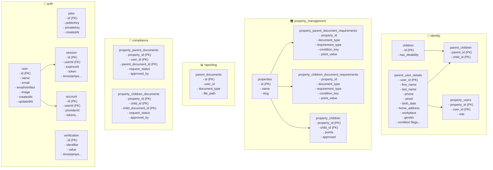

```mermaid
flowchart TB
    subgraph IDENTITY["🪪 identity"]
    parent_user_details["parent_user_details<br/>- user_id (PK)<br/>- first_name<br/>- last_name<br/>- phone<br/>- pesel<br/>- birth_date<br/>- home_address<br/>- workplace<br/>- gender<br/>- condition flags..."]
    children_tbl["children<br/>- id (PK)<br/>- has_disability"]
    parent_children["parent_children<br/>- parent_id (PK)<br/>- child_id (PK)"]
    property_users["property_users<br/>- property_id (PK)<br/>- user_id (PK)<br/>- role"]
    end

    parent_user_details --> parent_children
    children_tbl --> parent_children
    parent_user_details --> property_users

    subgraph PROPERTY_MANAGEMENT["🏘️ property_management"]
    properties["properties<br/>- id (PK)<br/>- name<br/>- slug"]
    parent_doc_reqs["property_parent_document_requirements<br/>- property_id<br/>- document_type<br/>- requirement_type<br/>- condition_key<br/>- point_value"]
    children_doc_reqs["property_children_document_requirements<br/>- property_id<br/>- document_type<br/>- requirement_type<br/>- condition_key<br/>- point_value"]
    property_children_tbl["property_children<br/>- property_id (PK)<br/>- child_id (PK)<br/>- points<br/>- approved"]
    end

    properties --> parent_doc_reqs
    properties --> children_doc_reqs
    properties --> property_children_tbl

    subgraph REPORTING["📊 reporting"]
    parent_documents["parent_documents<br/>- id (PK)<br/>- user_id<br/>- document_type<br/>- file_path"]
    end

    subgraph COMPLIANCE["🧾 compliance"]
    property_parent_documents_tbl["property_parent_documents<br/>- property_id (PK)<br/>- user_id (PK)<br/>- parent_document_id (PK)<br/>- request_status<br/>- approved_by"]
    property_children_documents_tbl["property_children_documents<br/>- property_id (PK)<br/>- child_id (PK)<br/>- child_document_id (PK)<br/>- request_status<br/>- approved_by"]
    end

    subgraph AUTH["🔐 auth"]
    jwks_tbl["jwks<br/>- id (PK)<br/>- publicKey<br/>- privateKey<br/>- createdAt"]
    user_tbl["user<br/>- id (PK)<br/>- name<br/>- email<br/>- emailVerified<br/>- image<br/>- createdAt<br/>- updatedAt"]
    session_tbl["session<br/>- id (PK)<br/>- userId (FK)<br/>- expiresAt<br/>- token<br/>- timestamps..."]
    account_tbl["account<br/>- id (PK)<br/>- userId (FK)<br/>- providerId<br/>- tokens..."]
    verification_tbl["verification<br/>- id (PK)<br/>- identifier<br/>- value<br/>- timestamps..."]
    end

    user_tbl --> session_tbl
    user_tbl --> account_tbl
```
